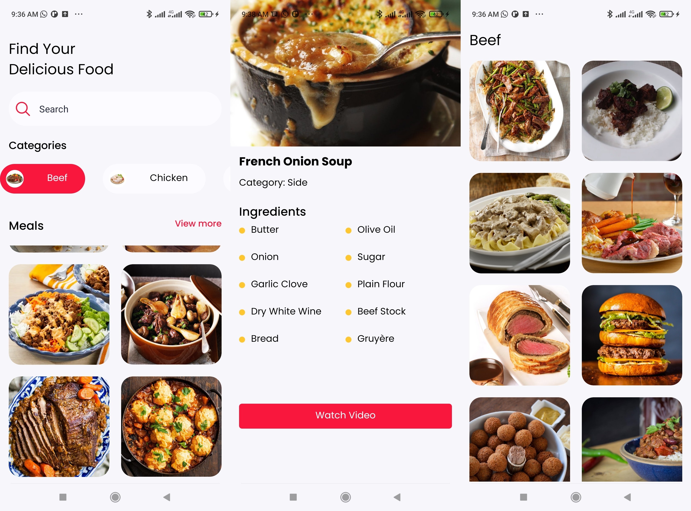

# Compose Recipe

This is an online Recipe app that consumes theMealdb API. UI built using Jetpack compose.

This is a small app but I tried to structure it following the clean architecture pattern - data, domain, presentation

The compose UI isn't great but it is a start.

## Screens

## Credits

##Todo
- Implement search feature
- 